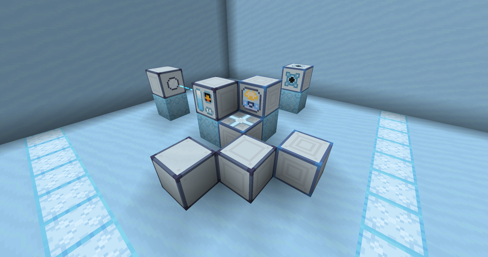
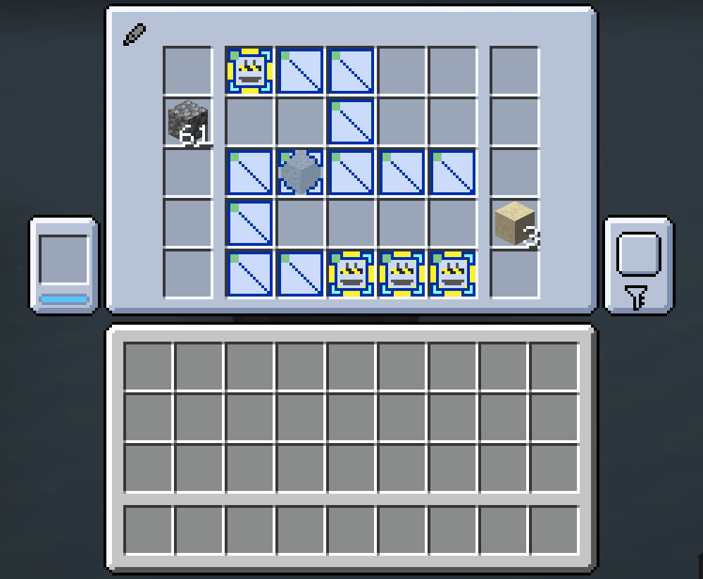
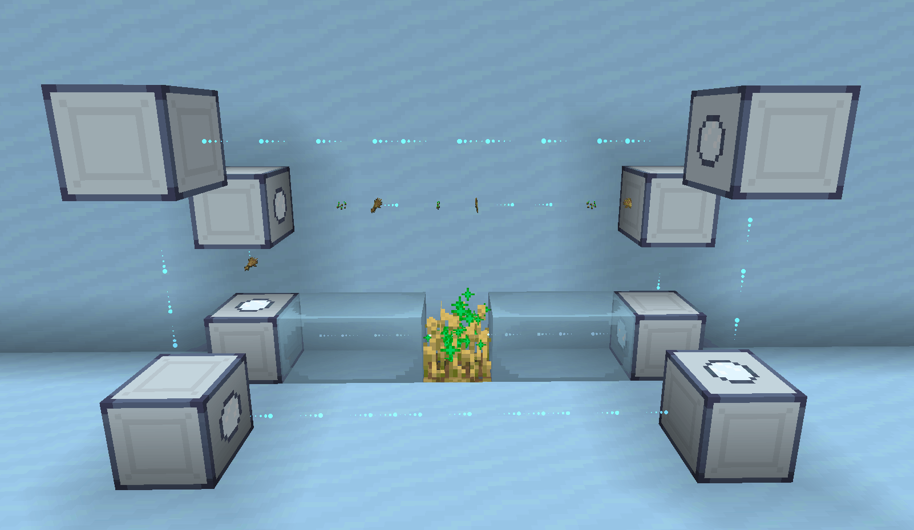
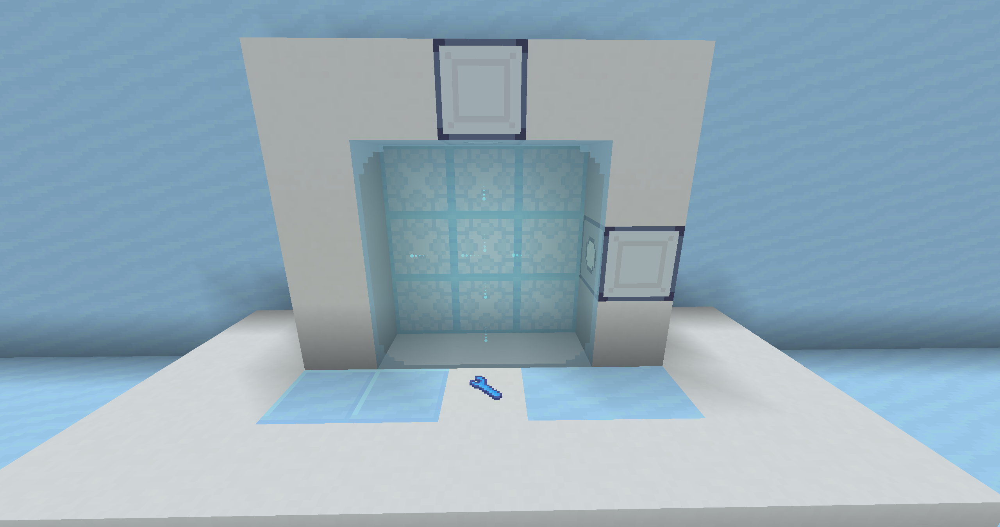

# 欢迎来到以太工艺！

以太工艺（Ether Craft）是一个以「摆格子」为底层设计的科技模组。与多数科技模组不同，它把「机器如何构成」也交给玩家定义：机器的具体功能，由玩家向格子里放入什么来决定。

「摆格子」体现在两处：一是向以太适应节点的功能/升级格子中装入插件；二是在以太加工中心内部，用芯片与隔板把产线一格一格搭出来。

以太工艺仍在开发中，部分内容尚未完成。若对模组有意见或建议，可通过 [GitHub 仓库](https://github.com/FantasyIT-Projects/ether-craft-neo) 或模组 QQ 群（1038876287）联系。

## 1 以太适应节点：往格子里塞插件

节点刚合成出来是空的，没有功能，需要玩家向格子中装入插件来实现不同的功能。

插件分「功能」和「升级」两类，前者负责生产或使用以太，后者多为数值强化。以与以太流相关的升级为例：任意镐/斧/锹/锄让以太流破坏对应方块，任意剑让它攻击生物；船、矿车让它携带生物；成书让它飞行时显示书中文字。插件不同，节点的外观也随之改变。

## 2 以太加工中心：在机器里摆产线

工厂是「摆格子」最集中的体现：产线要你在机器内部，用芯片与隔板一格一格搭出来。下图是加工界面，芯片已按配方排成产线：

产线需为严格一格宽的通道，墙壁由隔板或芯片构成；墙上的芯片决定这一步加工什么，JEI 会标明需要单芯片还是双芯片。搭好后即使机器内无以太也能预览产物；若配方不生效，多因多摆了一道加工。通以太即可开工，但工厂里的以太会随时间衰减——配方不全、墙壁有缺口、通路外多出空行都会泄漏（悬停灯条可检测，正常应为 0）；以太量达到所有芯片上限总和的约 10 倍时，机器会提速加耗，因而常在两个速度档间切换。

## 3 以太与以太流：组合功能，连接方块

以太是供能之物，以物品形态存在，一个物品对应 100 点以太能量（E）。它由适应节点生产、向机器供能；扔到地面会逐渐失活，一组以太转化一个失活以太。失活以太是模组的起点：挖以太矿石获得，可与书合成「以太工艺指南」，或合成适应节点。

以太经以太流使用。以太流是发射器射出的能量流，承担物流与供能：喷射出去，碰到能接收以太的方块便自动充入，沿途携带的物品一并卸下；也可为镀层装备充能。

## 4 镀层：装备强化

镀层是强化装备的另一途径，与附魔、词条不冲突。用搭载汇流芯片的以太流（镀层流）为装备镀层，核心是含有一颗以太粉；加入其他物品可赋予不同效果，且可叠加多层。

## 5 玻璃与杂项

以太玻璃是无边框玻璃：以太流穿过普通玻璃或击中玻璃掉落物即可转化；它不会碎、可用扳手拆除，以太流在内部穿行时减少飞行消耗，按住 Alt 可隔玻璃操作后方物品。

扳手可转向、破坏，也能镀层；副手扳手、主手插件点节点可快速装插件。
