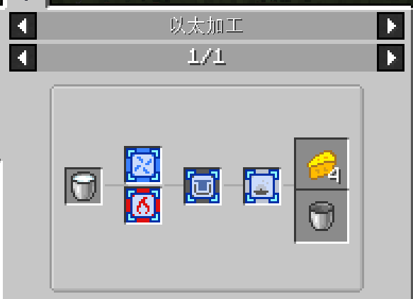
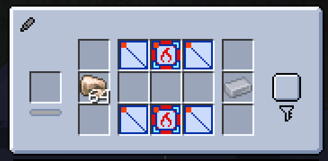
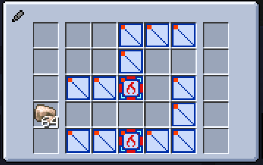
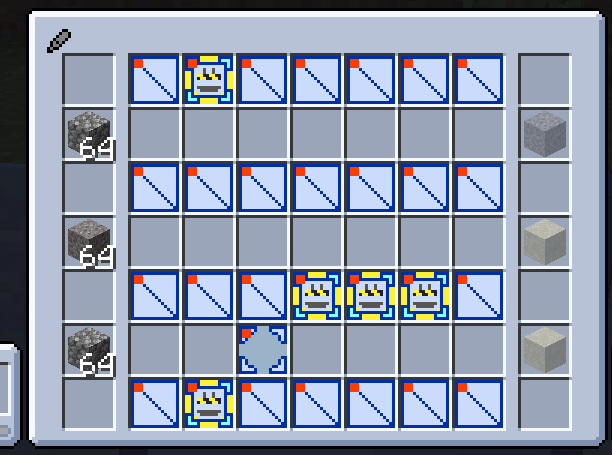

---
navigation:
  title: 以太加工中心
  position: 7
item_ids:
  - ether_craft:ether_process_factory_1
  - ether_craft:ether_process_factory_2
  - ether_craft:ether_process_factory_3
  - ether_craft:ether_process_factory_4
---

# 以太加工中心

以太加工中心（以下简称工厂）为模组的主要机器。其特点在于产线需玩家在内部拼搭。

## 拼搭基本规则

- 产线必须为严格的、一格宽的、一或多输入、一输出的**"通道"**，"墙壁"由隔板或各个芯片搭出。如下为两个合法通道的示例：

<Row>
  <FloatingImage src="assets/factory_1.png" align="left" />
  <FloatingImage src="assets/factory_2.png" align="left" />
</Row>
 

- 每一格通道在合法情况下应有两个连通口与两个墙壁，墙壁上的芯片则为该格有效的加工芯片。如上图 [2,1] 格被两个加热芯片加工，而 [4,2] 格仅被一个冲压芯片加工。另外，转角处的 [2,4] 也被双芯片加工（一个切割，一个冲压）。

JEI 会显示具体的加工需求，路线上下各有一个芯片为该步骤需要双芯片加工，而路线被一个芯片盖住则为单芯片加工：

- 配方在拼接完成后，即使机器内无以太，放入原料也可以预览产物，你可以用这个判断配方是否生效：

- 多余加工步骤会导致配方不生效，发现产线不对时可以看看是否有哪里芯片的侧面多加工了一次：

- 输入不能为第一行和最后一行，机器的墙壁并不能作为产线的墙壁。

- 特别的，多个并行输入之间可以在一格距离内不使用墙壁，依然视为有效通道，但输出侧不行：

<Row>
  <FloatingImage src="assets/factory_6.png" align="left" />
  <FloatingImage src="assets/factory_7.png" align="left" />
</Row>
 

- 有一个特殊的芯片叫**"连接芯片"**，它可以用于把两个配方搭建在一个工厂里，例如把圆石合成沙砾、沙砾合成沙子拼接起来：

## 工厂生产机制

成功搭建配方后，可以向机器通入以太并生产了。工厂生产是个不确定性较多的过程，因为每个芯片会随时需求以太，且以太不再像适应节点内的一样稳定——它们会自己消失！

### 泄漏

- 配方非法、墙壁有漏洞的工厂会泄露以太，这可以用鼠标悬浮灯条检测。正常情况下泄露应为 0。
- 配方合法，但配方通路外有空行的工厂也会泄露以太，要注意。合法配方内部空行不产生泄露。

<Row>
  <FloatingImage src="assets/factory_8.png" align="left" />
  <FloatingImage src="assets/factory_9.png" align="left" />
</Row>
 

- 泄露的消耗量与加工的消耗量、自然消耗量不是一个量级，应尽可能避免。

### 芯片以太

- 加工时，充入机器的以太会轮流给到每个芯片与隔板，且芯片隔板内的以太会缓慢流失。
- 加工读条需要芯片、隔板内的 E 满足某个最低值，且读条完成后需要一次性扣除更多的 E 来完成一次加工。
- 芯片与隔板右上角的灯表明该芯片 E 是否充足，加工读条时保持长时间红灯会导致加工中断（偶尔闪红没事）。
- 芯片与隔板需要的 E 不尽相同，大致数量级可以鼠标悬浮其上显示。最低保持值、加工扣除值和芯片能存储的最大值均正比于这个系数。

### 速度层级

当芯片内几乎维持满以太状态时，机器的以太开始盈余（可查看灯条显示存量）。当 E 达到所有芯片存储量上限的 10 倍（大概）以上时，会增加消耗与加工速度，增加消耗可能导致以太量的回落。这意味着大部分情况下你的机器会在某两个速度层级之间反复横跳。

## 配方方案

主线后期物品的加工配方可能会非常繁杂，需要研究好一会儿。如果实在想不出来，可以查看"以太合成方案"里的官方解（别担心，到难度上升的部分已经可以体验到模组内容的90%了，最后一点点主线机器和毕业芯片只是多了几个配方）。
